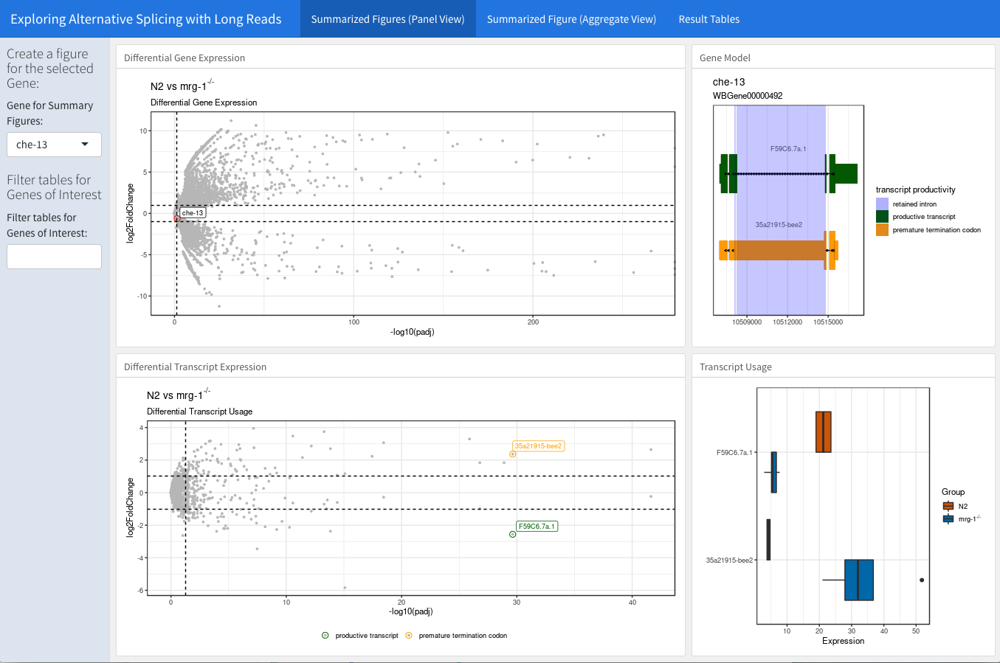
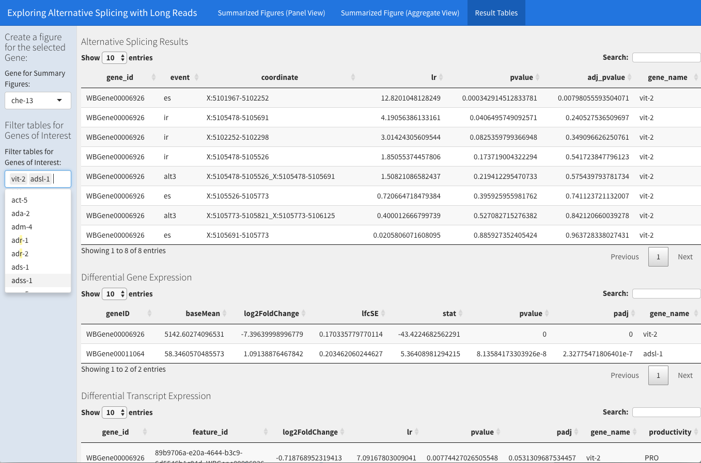

# flairExplorer

flairExplorer is a package for the visualization and interactive exploration of 
results generated from the [flair pipeline](https://github.com/BrooksLabUCSC/flair).

It provides a bash script to run a series of commands from the flair pipeline in a batch mode
and a shiny based dashboard to visualize results in a aggregated manner. 

While the flair pipeline itself includes some plotting scripts to visualize isoform usage, 
other data generated in the process can be best inspected in IGV, for example the productivity bed file. 
And there was no script to visualize the differential analysis results in a comprehensive manner, 
such as a volcano plot. This is why I came up with the interactve dashboard,
to visualize results in a gene centric manner, allowing to directly connect the outcome of all three
analysis, differential gene and transcript usage and differential splicing.



In addition all the resulsts of the differential analysis are provided as interactive tables 
with an additional overall gene filter at shorthand. 




## Installation


You may install the package as follows:
```bash
git clone https://github.com/alexg9010/flairExploreR.git
cd flairExplorer
```

### Managing Dependencies

This package depends on the [flair pipeline](https://github.com/BrooksLabUCSC/flair), which is imported as submodule when you run the above command. To run the pipeline you need to install its dependencies, I recommend using conda for this. 

#### flair 

You may install the dependencies of the flair pipeline via conda, 
flair ships a conda environment file, that can be found at `./lib/flair/misc/flair_conda_env.yaml`

Assuming you are in the package folder, you can create a local conda environment in the project folder:    
```bash
conda env create -f lib/flair/misc/flair_conda_env.yaml -p lib/flair/conda-env
ln -s lib/flair/conda-env flair-env 
```

#### flairExplorer dashboard

The dashboard is writtin in R and requires some more dependencies, but these can also be installed with conda:
```bash
conda env create -f misc/flairExploreR_conda_env.yaml -p misc/conda-env
ln -s misc/conda-env flairExplorer-env
```

